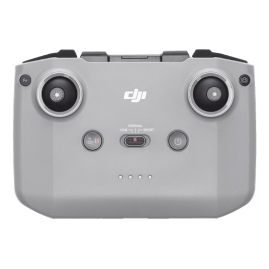
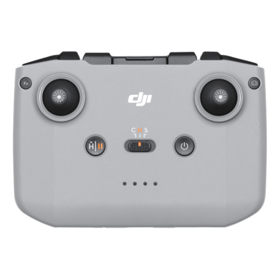

# DJI RC-N1 (or N3) as a Windows Controller

This project reads stick positions from a DJI RC-N1 or N3 remote controller and
maps them to Windows keyboard and mouse input for PC games.

> This fork modifies the original project to validate serial packets, stop stale
> input after communication failures, release held keys during shutdown, support
> explicit serial-port selection, and standardize project text in English.




## Installation and Usage

### Option 1 - Prebuilt binary (no Python needed)

Download `DJI-RC-winGamePad-<version>.zip` from the [Releases](../../releases) page,
extract it anywhere, and run `DJI-RC-winGamePad.exe` from the extracted folder.
You still need the device drivers below, since a binary can't replace them:

- Install **[DJI Assistant 2 (Consumer Drones Series)](https://www.dji.com/downloads/softwares/dji-assistant-2-consumer-drones-series)**,
  then close it. This is the recommended way to install the required DJI USB VCOM
  driver. To install only that driver instead, follow [DRIVER_INSTALL.md](DRIVER_INSTALL.md).
- **[ViGEmBus 1.22.0](https://github.com/nefarius/ViGEmBus/releases/download/v1.22.0/ViGEmBus_1.22.0_x64_x86_arm64.exe)**
  is required for the default `vgamepad` mode. Download and run that installer once;
  it automatically selects the correct Windows architecture. The `directinput` and
  `pynput` modes do not require ViGEmBus.

> It's a one-folder app (the `.exe` sits next to its runtime DLLs), which avoids blocked
> `%TEMP%` DLL extraction. Keep the folder contents together. Windows SmartScreen may
> warn about the unsigned executable; click **More info -> Run anyway** when that option
> is available.
>
> **Smart App Control warning:** On some Windows 11 devices, including a tested ROG Xbox
> Ally, Smart App Control can block this unsigned executable without offering **Run
> anyway**. Do not disable Smart App Control casually: turning it off reduces system-wide
> protection, and Windows may require a reset or reinstall before it can be enabled again.
> Prefer the Python installation below if the executable is blocked. If you choose to
> disable Smart App Control, first verify the ZIP against its `.sha256` file and understand
> the Windows security implications.

Run it from a terminal to pass flags, e.g. `.\DJI-RC-winGamePad.exe --backend directinput`.
The folder also includes `DJI-RC-winGamePad-test.exe` - the controller tester (opens a
window, injects no input) for verifying the controller and driver before use.

### Option 2 - From source (Python)

1. Install [DJI Assistant 2 (Consumer Drones Series)](https://www.dji.com/downloads/softwares/dji-assistant-2-consumer-drones-series), then close it.

   > This step is only needed for its **USB VCOM driver**, which creates the serial
   > port the adapter reads. If you'd rather not install the full application, you can
   > install just that driver instead — see [DRIVER_INSTALL.md](DRIVER_INSTALL.md).

2. Install Python 3.9 or later.
3. Install the Python dependencies:

```powershell
python -m pip install -r requirements.txt
```

  This installs `pyserial` plus the modules for every included input backend:
  `vgamepad`, `pydirectinput`, and `pynput`.

  The default `vgamepad` backend requires the open-source
  **[ViGEmBus 1.22.0 installer](https://github.com/nefarius/ViGEmBus/releases/download/v1.22.0/ViGEmBus_1.22.0_x64_x86_arm64.exe)**
  (unrelated to DJI). Download and run the `.exe` once, accepting the UAC prompt; it
  automatically selects the correct Windows architecture. You can verify the virtual
  pad afterwards with `joy.cpl` (Set up USB game controllers). The `directinput` and
  `pynput` backends do not need ViGEmBus.

4. Power on the RC-N1 or N3 and connect its bottom USB-C port.
5. Start the adapter, then start the game:

```powershell
python main.py
```

The serial port is detected automatically. To select one explicitly:

```powershell
python main.py --port COM9
```

Choose the input backend with `--backend`:

```powershell
python main.py                        # vgamepad (default) - virtual Xbox gamepad for drone/FPV sims
python main.py --backend directinput  # directinput - keyboard/mouse for games
python main.py --backend pynput       # pynput - keyboard/mouse for normal desktop apps
```

### Which backend should I use?

The right backend depends on **how the target application reads input**, not on
what the app is. Use this guide:

| Your case | Backend | Why |
| --- | --- | --- |
| Drone/FPV simulators, racing sims, flight sims, or any game with **gamepad/controller support** | `vgamepad` *(default)* | The sticks stay **analog and proportional**, so you get smooth throttle/yaw/pitch/roll instead of on/off key presses. |
| PC games that only accept **DirectInput / raw keyboard & mouse** (many FPS and older/native titles, e.g. Minecraft) | `directinput` | Sends low-level scan-code key presses and raw mouse motion that games detect even when higher-level input is ignored. |
| **Normal desktop apps**, browsers, emulators, or scripting where you want ordinary key/mouse events | `pynput` | Uses standard OS-level input events that regular windowed apps accept, but which many games filter out. |

Rules of thumb:

- **Start with the default (`vgamepad`).** If the app has any "controller"
  settings, this is almost always the best choice — analog sticks feel natural
  and you can rebind/calibrate inside the app.
- **Switch to `directinput`** if a game ignores the virtual gamepad or you want
  keyboard/mouse control (WASD + mouse-look) instead of a stick.
- **Use `pynput`** only for non-game software, or if `directinput` types nothing
  in a normal window. It's the most compatible for desktop apps but the least
  compatible with games.

If you're unsure, try them in that order: `vgamepad` → `directinput` → `pynput`.

### What each backend maps

**`vgamepad` (default)** presents the controller as a virtual Xbox gamepad:

| Controller input | Xbox gamepad output |
| --- | --- |
| Left stick | Left thumbstick (throttle/yaw) |
| Right stick | Right thumbstick (pitch/roll) |
| Left dial | Triggers / Z axis (spring-returns to center) |
| Fn / Photo·Video / Record / RTH | X / Y / A / B buttons |
| Flight-mode switch (Cine/Normal/Sport) | D-pad (left/up/right) |

This is ideal for drone/FPV sims such as Liftoff, Velocidrone, DRL Simulator,
The DCL, FPV Freerider, and Uncrashed. Calibrate the axes in the sim. It requires
the **ViGEmBus** driver (see Requirements above); verify the pad with `joy.cpl`.

**`directinput`** and **`pynput`** map the left stick to **WASD**, the right stick
to **mouse-look**, the buttons to taps (Record=R, RTH=Backspace, Fn=Esc,
Photo/Video=C), and the flight-mode switch to keys 1/2/3. They need no driver;
`directinput` targets games, `pynput` targets desktop apps.

The DUML protocol (serial framing, checksums, stick/button decoding), the reader
thread, and the GUI live in the reusable `djirc` package (`djirc.protocol`,
`djirc.reader`, `djirc.gui`), shared by `main.py` and `test_control.py`.

A successful connection looks like this (default `vgamepad` backend):

```text
> python main.py
Connected: COM3  (backend: vgamepad)
Virtual Xbox pad: left stick = throttle/yaw, right stick = pitch/roll.
Buttons -> A/B/X/Y, flight mode -> D-pad. Calibrate in the sim. Ctrl+C to stop.
```

## Testing the controller

Before running a game, verify the controller, driver, and wiring with the test
script. It opens a small window and **does not inject any keyboard or mouse
input**, so it is safe to run anywhere:

```powershell
python test_control.py
```

- Each stick axis is shown as a live bar.
- Every packet byte is shown in a grid. Bytes that differ from a captured
  baseline are highlighted, so pressing a button lights up the byte(s) it uses —
  handy since buttons and dials are not decoded as named axes. Click
  **Set baseline** while the controller is idle to define the resting state.

## Controls

| Control | Action |
|---|---|
| Left stick | Keyboard `W` / `A` / `S` / `D` |
| Right stick | Mouse movement |
| Shutter/Record | `R` (reset / respawn) |
| Return to Home | `Backspace` (restart) |
| Fn | `Esc` (menu) |
| Photo/Video | `C` (camera) |
| Flight mode Sport / Normal / Cinematic | `1` / `2` / `3` |

Buttons and the flight-mode switch are read from the controller's `0x27` packet
and sent as single key taps (once per press). Edit `BUTTON_KEYS` / `MODE_KEYS` in
[main.py](main.py) to remap them.

## Notice

- Use `test_control.py` to confirm the controller itself works with any setup.
- If a game uses raw mouse input, disable it in the game's mouse settings.
- The left stick controls the keyboard.
- The right stick controls the mouse.

Stop the adapter with `Ctrl+C`. Held movement keys are released automatically.

## Citations

- Original project (Apache-2.0): https://github.com/AppStudioLB/DJI_RC-N1_winGamePad
- https://github.com/IvanYaky/DJI_RC-N1_SIMULATOR_FLY_DCL
- https://github.com/learncodebygaming/pydirectinput

## License

Licensed under the Apache License 2.0. This project is derived from
[AppStudioLB/DJI_RC-N1_winGamePad](https://github.com/AppStudioLB/DJI_RC-N1_winGamePad);
it retains the original license and attribution, and modified files are identified as
required by the license.
